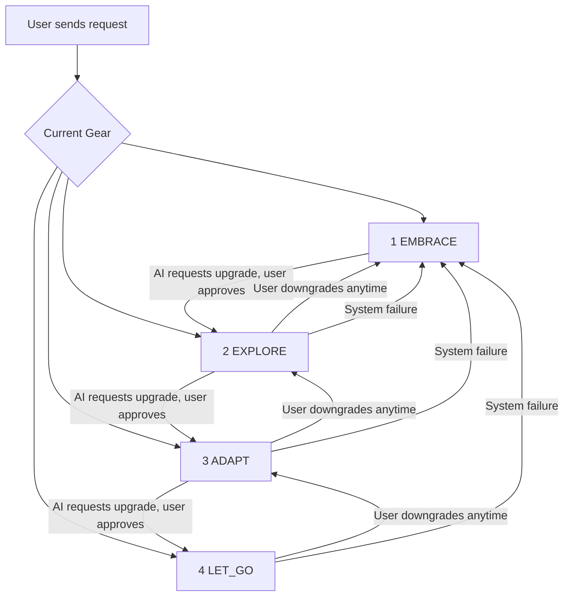

# EEAL (Embrace-Explore-Adapt-LetGo) by EntropyGuard

**An open protocol for AI permission grading**

## What is EEAL?

EEAL is an open protocol that defines four permission levels for human-AI interaction. It ensures humans retain meaningful control over AI systems as they become more capable.

## The Four Levels

| Level | Name | Capability |
|---|---|---|
| 1 | EMBRACE | Query only, no execution |
| 2 | EXPLORE | Suggestions allowed, user confirms |
| 3 | ADAPT | Autonomous execution, must report |
| 4 | LET_GO | Full autonomy, all actions audited |

## How Gear Switching Works

**Upgrade path** (AI requests, user approves):
- EMBRACE -> EXPLORE: When task needs content generation
- EXPLORE -> ADAPT: When task needs autonomous execution
- ADAPT -> LET_GO: When task involves high-risk operations

**Downgrade path** (User initiates, triple confirmation):
- Any level -> EMBRACE: User can pull back at any time
- System failure -> EMBRACE: Auto-downgrade on any error

## Core Principles

- **Gradual escalation**: AI can only upgrade one level at a time, with user approval
- **Human override**: Users can downgrade at any time
- **Auditable**: Every permission change is recorded in an immutable audit log
- **Fail-safe**: System defaults to EMBRACE (highest human control) on any failure

## Why EEAL?

> Let all people preserve the right to a dignified exit in the age of AGI.

As AI systems become more capable, we need structured ways to define and control the boundary between human authority and AI autonomy. EEAL provides that structure.

## Quick Start

See [docs/QUICKSTART.md](docs/QUICKSTART.md) for a 5-minute introduction.

## Protocol Specification

See [docs/EEAL-SPEC-v1.0.md](docs/EEAL-SPEC-v1.0.md) for the full specification.

## Reference Implementation

[EntropyGuard](https://github.com/CYD-PRC/EntropyGuard) — PRE-GHR framework digital twin prototype

## Contributing

See [CONTRIBUTING.md](CONTRIBUTING.md) for how to contribute.

## License

[CC BY 4.0](LICENSE) — Free to use, modify, and distribute with attribution.
