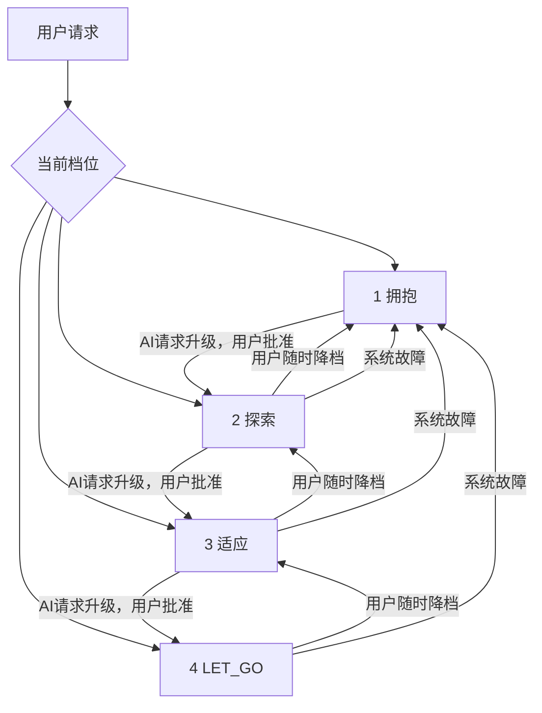

# EEAL (Embrace-Explore-Adapt-LetGo) Protocol

[](https://creativecommons.org/licenses/by/4.0/)
[](https://github.com/CYD-PRC/EEAL/stargazers)
[](https://github.com/CYD-PRC/EEAL/issues)

**An open protocol for AI permission grading and human-AI collaboration**  
License: CC BY 4.0  

---

## 📖 Table of Contents

- [Overview](#overview)  
- [The Four Permission Levels](#the-four-permission-levels)  
- [Gear Switching (Upgrade / Downgrade)](#gear-switching-upgrade--downgrade)  
- [Quick Example](#quick-example)  
- [Motivation](#motivation)  
- [Reference Implementation](#reference-implementation)  
- [Contributing](#contributing)  
- [Roadmap](#roadmap)  
- [License](#license)  

---

<h2 id="overview">🚀 Overview</h2>

EEAL is an open protocol that defines **four permission levels** for AI systems interacting with humans.  
It ensures that humans retain meaningful control over AI behavior while allowing AI to operate autonomously within defined boundaries.

> "Let all people preserve the right to a dignified exit in the age of advanced AI systems."

**Key goals:**
- **Perceivable:** Users can sense the current AI permission level via UI or physical feedback.  
- **Auditable:** Every permission change generates an immutable record.  
- **Executable:** Permission levels map directly to AI behavior constraints.  
- **Implementable:** Can be implemented in any technology stack.

<h2 id="the-four-permission-levels">🛠 The Four Permission Levels</h2>

| Level | Name     | Capability                                      |
|-------|---------|------------------------------------------------|
| 1     | EMBRACE | Query only, no execution                        |
| 2     | EXPLORE | Suggestions allowed; user confirms actions     |
| 3     | ADAPT   | Autonomous execution, must report results     |
| 4     | LET_GO  | Full autonomy; all actions are audited         |

**Quick summary:**
- **EMBRACE:** AI is a tool, fully controlled by humans.  
- **EXPLORE:** AI can provide suggestions; execution requires approval.  
- **ADAPT:** AI can act autonomously; results must be reported.  
- **LET_GO:** AI has full autonomy; humans retain post-action veto power.

<h2 id="gear-switching-upgrade--downgrade">⚙️ Gear Switching (Upgrade / Downgrade)</h2>



**Rules:**
- **Upgrade:** AI requests → User approves → One level at a time  
- **Downgrade:** User can downgrade anytime → Triple confirmation recommended  
- **Fail-safe:** System defaults to **EMBRACE** on failure

<h2 id="quick-example">💡 Quick Example</h2>

**Sample audit event (JSON):**

```json
{
  "event_id": "uuid-v7",
  "timestamp": "2026-05-05T12:34:56Z",
  "old_gear": 2,
  "new_gear": 3,
  "direction": "up",
  "source": "ai_upgrade_request",
  "reason": "User requested task execution",
  "risk_level": "medium"
}
```

**Minimal Python example:**

```python
class EEAL:
    def __init__(self):
        self.gear = 1

    def upgrade(self):
        if self.gear < 4:
            self.gear += 1
            print(f"Gear upgraded to {self.gear}")
        else:
            print("Already at LET_GO")

    def downgrade(self):
        if self.gear > 1:
            self.gear -= 1
            print(f"Gear downgraded to {self.gear}")
        else:
            print("Already at EMBRACE")

ai = EEAL()
ai.upgrade()   # Gear upgraded to 2
ai.downgrade() # Gear downgraded to 1
```

<h2 id="motivation">📚 Motivation</h2>

Current AI systems often lack **fine-grained permission control**.  
EEAL solves this by providing:

- **Structured control:** Four permission levels to manage AI autonomy  
- **Auditability:** Every action is logged for accountability  
- **Safety:** Fail-safe defaults prevent AI overreach  
- **Flexibility:** Supports multiple domains, from enterprise workflow to multi-model AI platforms

<h2 id="reference-implementation">🏗 Reference Implementation</h2>

- [EntropyGuard — PRE-GHR digital twin prototype](https://github.com/CYD-PRC/EntropyGuard)  
*(Code for minimal EEAL implementation and integration examples)*

<h2 id="contributing">🧩 Contributing</h2>

We welcome contributions! Please refer to the [CONTRIBUTING.md](CONTRIBUTING.md) file for detailed guidelines.

For questions or suggestions, feel free to open an issue in the repository.

<h2 id="roadmap">📈 Roadmap</h2>

- **v1.1:** Audit log query API, customizable notifications  
- **v1.2:** Industry compliance modules (finance, healthcare)  
- **v2.0:** Automated compliance audits, multi-model adaptation

<h2 id="license">📜 License</h2>

EEAL is licensed under **CC BY 4.0** — free to use, modify, and distribute, with attribution.
