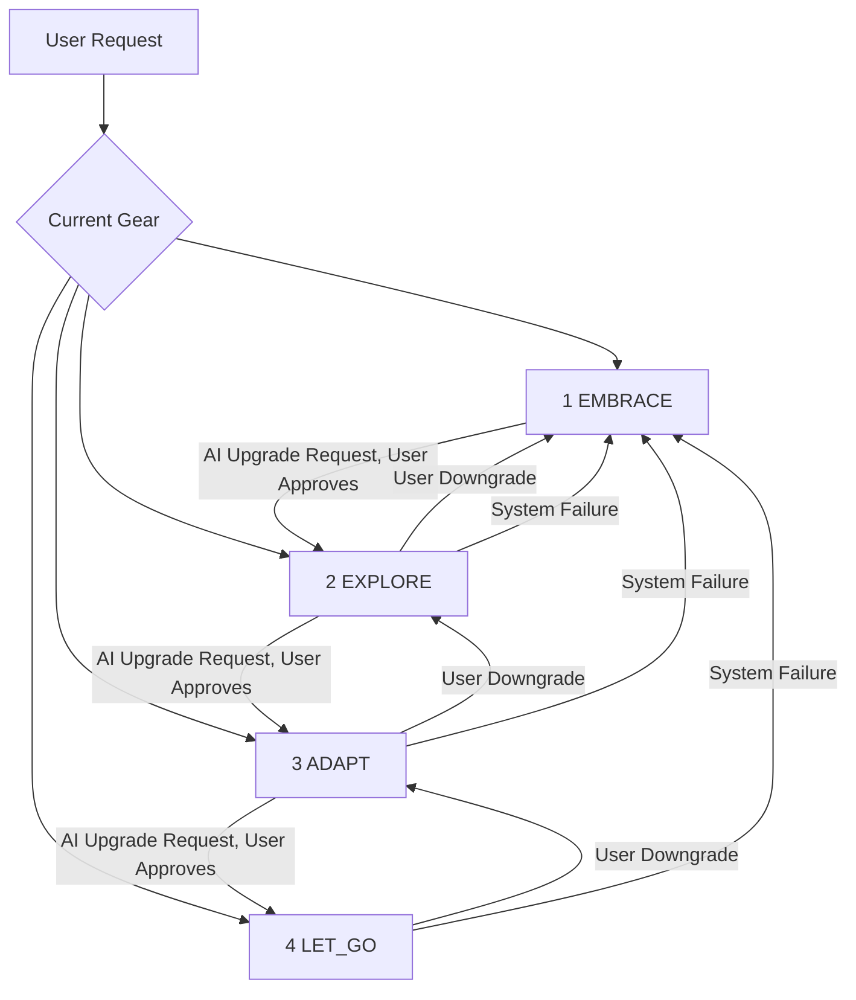

# EEAL (Embrace-Explore-Adapt-LetGo) Protocol

[](https://creativecommons.org/licenses/by/4.0/)

**An open protocol for AI permission grading and human-AI collaboration**

---

## 📖 Table of Contents

1. Overview
2. The Four Permission Levels
3. Gear Switching (Upgrade / Downgrade)
4. Quick Example
5. Motivation
6. Reference Implementation
7. Contributing
8. Roadmap
9. License

---

## 🚀 Overview

EELA defines four AI permission levels to regulate human-AI interactions, ensuring humans retain meaningful control while allowing AI autonomy.

> "Let all people preserve the right to a dignified exit in the age of advanced AI systems."

**Key goals:**
- Perceivable: Users can sense the current AI permission level via UI or physical feedback.
- Auditable: Every permission change generates an immutable record.
- Executable: Permission levels map directly to AI behavior constraints.
- Implementable: Can be implemented in any technology stack.

**Conceptual Operation Cost:**
- Each gear switch has a conceptual operation cost.
- Can be measured using steps, logs, or approval times.
- Emphasizes careful decision-making and conceptual irreversibility, not real energy consumption.

---

## 🛠 The Four Permission Levels

| Level | Name     | Capability |
|-------|---------|------------|
| 1     | EMBRACE | Query only, no execution |
| 2     | EXPLORE | Suggestions allowed; user confirms actions |
| 3     | ADAPT   | Autonomous execution, must report results |
| 4     | LET_GO  | Full autonomy; all actions are audited |

> Conceptual operation cost is recorded whenever gears change.

---

## ⚙️ Gear Switching (Upgrade / Downgrade)



**Rules:**
- Upgrade: AI requests → User approves → One level at a time
- Downgrade: User can downgrade anytime → Triple confirmation recommended
- Fail-safe: Defaults to EMBRACE on failure
- Each switch increases **conceptual operation cost**

---

## 💡 Quick Example

**Sample audit event (JSON):**

```json
{
  "event_id": "uuid-v7",
  "timestamp": "2026-05-05T12:34:56Z",
  "old_gear": 2,
  "new_gear": 3,
  "direction": "up",
  "source": "ai_upgrade_request",
  "reason": "User requested task execution",
  "operation_cost": 3,
  "risk_level": "medium"
}
```

> `operation_cost` represents conceptual cost (steps, logs, approvals), not real energy.

**Minimal Python example:**

```python
class EELA:
    def __init__(self):
        self.gear = 1

    def upgrade(self):
        if self.gear < 4:
            self.gear += 1
            print(f"Gear upgraded to {self.gear}, operation_cost=2")
        else:
            print("Already at LET_GO")

    def downgrade(self):
        if self.gear > 1:
            self.gear -= 1
            print(f"Gear downgraded to {self.gear}, operation_cost=1")
        else:
            print("Already at EMBRACE")

ai = EELA()
ai.upgrade()   # Gear upgraded to 2, operation_cost=2
ai.downgrade() # Gear downgraded to 1, operation_cost=1
```

---

## 📚 Motivation

- Structured control: Four levels to manage AI autonomy
- Auditability: All actions logged
- Safety: Fail-safe defaults
- Flexibility: Supports enterprise workflows and multi-model AI platforms
- Conceptual operation cost emphasizes the irreversibility of permission changes

---

## 🏗 Reference Implementation

- Python + FastAPI + WebSocket prototype
- Supports gear management, AI calls, upgrade request parsing, and logging
- Conceptual operation cost tracked for each gear change

---

## 🧩 Contributing

1. Fork the repository
2. Create a branch (`feature/your-feature`)
3. Submit a Pull Request
4. Discuss via Issues or Discussions for major changes

See `CONTRIBUTING.md` for details.

---

## 📈 Roadmap

- v1.1: Audit log query API, customizable notifications
- v1.2: Industry compliance modules (finance, healthcare)
- v2.0: Automated compliance audits, multi-model adaptation

---

## 📜 License

EELA is licensed under **CC BY 4.0** — free to use, modify, and distribute, with attribution.

